<h1>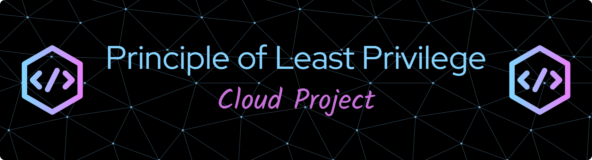</h1>

<h2>Description</h2>
I created this project to demonstrate the idea of Least Privilege in the cloud.
I've always found it easiest to think of Least Privilege like a hotel key card: the user only gets the specific permissions or access they need for their job. For example, a housekeeper gets a key to the rooms they clean, but never the master key or access to the hotel safe.
I built an AWS Identity and Access Management policy to ensure a user could only read a file, but they would be blocked if they tried to delete the file.
  

<h2>Languages and Utilities Used</h2>

- <b>JSON</b>
- <b>AWS Management Console</b>

<h2>🖥️Environments Used💻 </h2>

- <b>Amazon Web Services</b>
- <b>AWS Identity and Access Management (IAM)</b>
- <b>S3 Standard Storage</b>

## Project walk-through:

### 1. ☁️ Setup S3 Buckets / Uploaded File
  I created a private S3 bucket and uploaded a file. I will be testing to make sure a user can download this file but not delete it based on the user permissions.

  
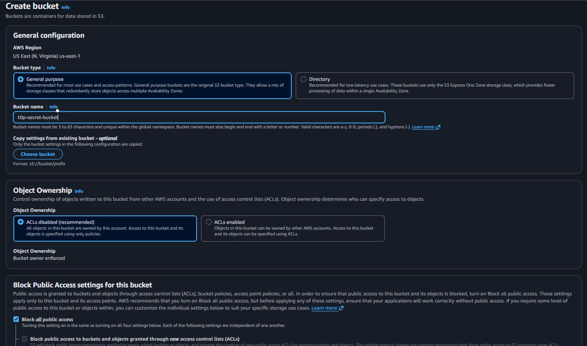
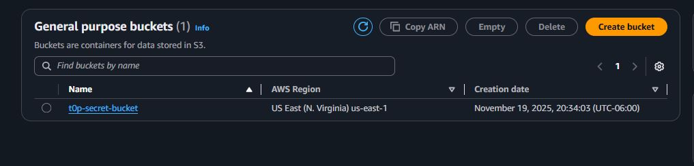
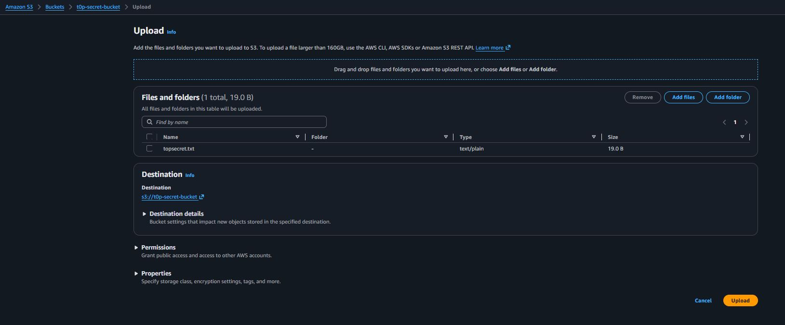
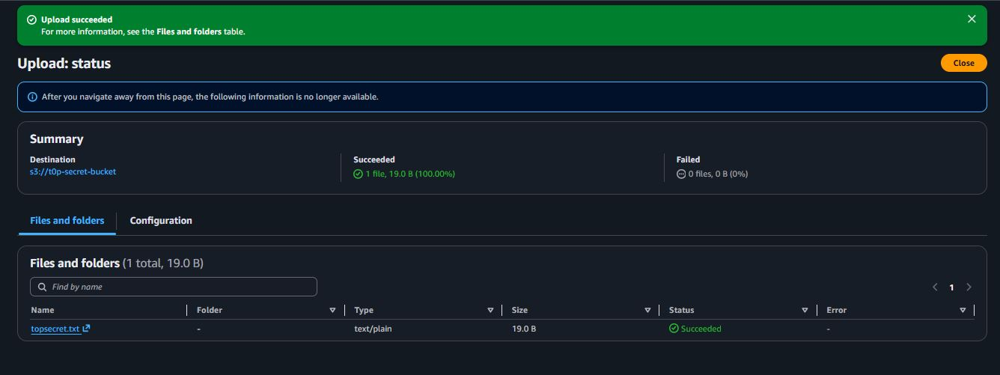
  
---

### 2. 👤 Create the Restricted User 
  I created a new IAM user (RestrictedUser) with a custom password.

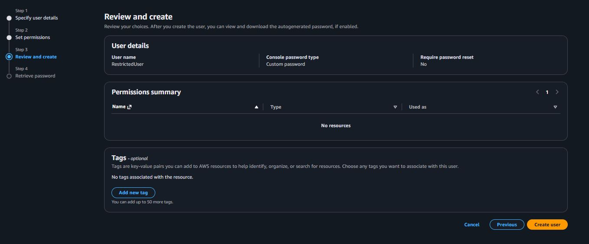  

---  
### 3. 📝 Obtain and Configure the Least Privilege Policy
  I used a JSON policy that included only read permissions on the t0p secret bucket, and a few extra permissions to allow the user to see the S3 console page.

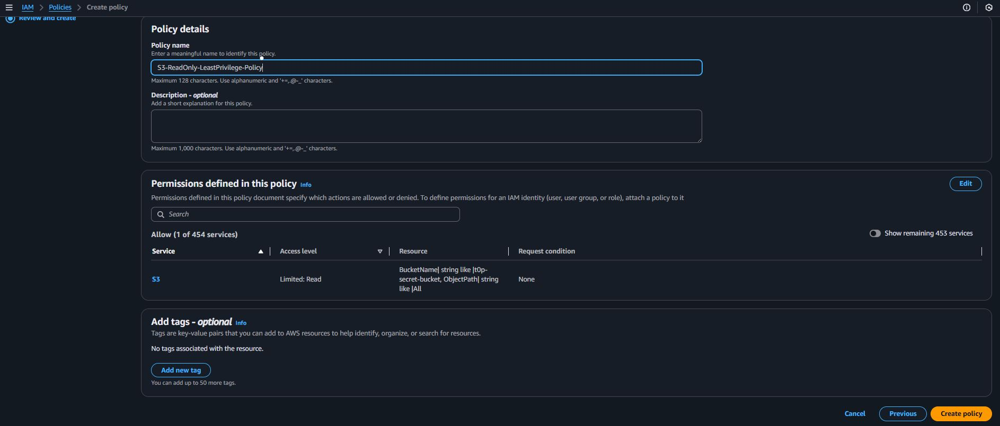
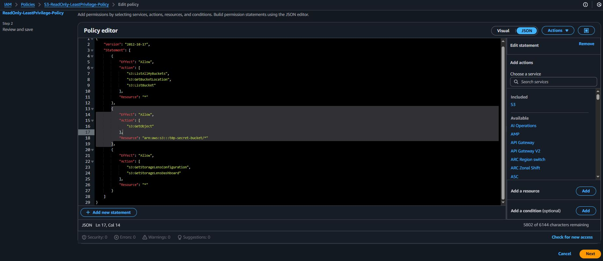

---
### 4. 🔗 Attach and Test the Policy
  I added the policy to the RestrictedUser and logged in to a separate browser session to test. The user was able to download the file from the bucket, but when the user tried to delete the file, the user received an "Access Denied" error, which was the intended result.

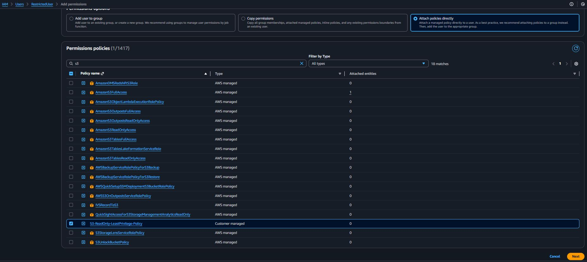
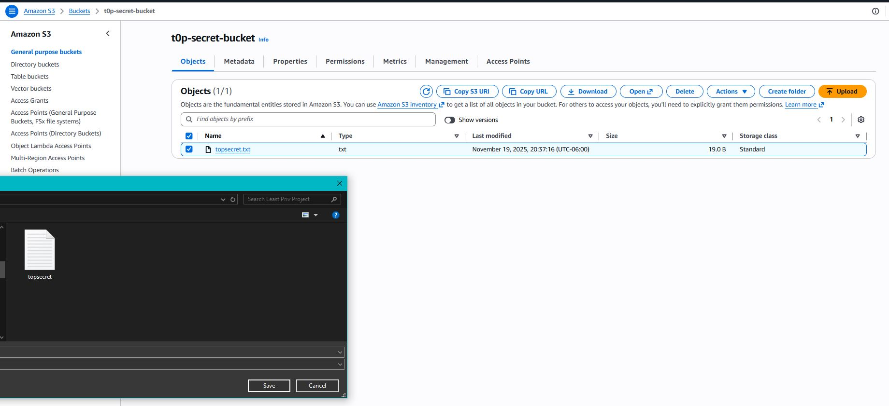
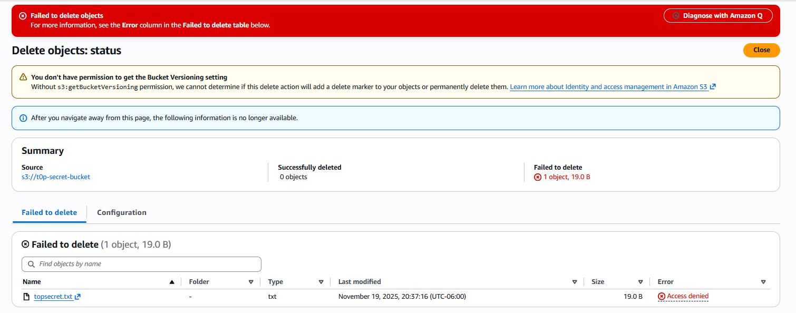

---

<h2>Goal:</h2>
The primary goal of this project was to gain practical, hands-on experience in implementing the Principle of Least Privilege (PoLP). I aimed to demonstrate proficiency in using AWS Identity and Access Management (IAM) to create a policy that grants a user only the minimum permissions (read-only) required for a job, thereby confirming my ability to secure cloud resources against excessive or damaging actions.

---

